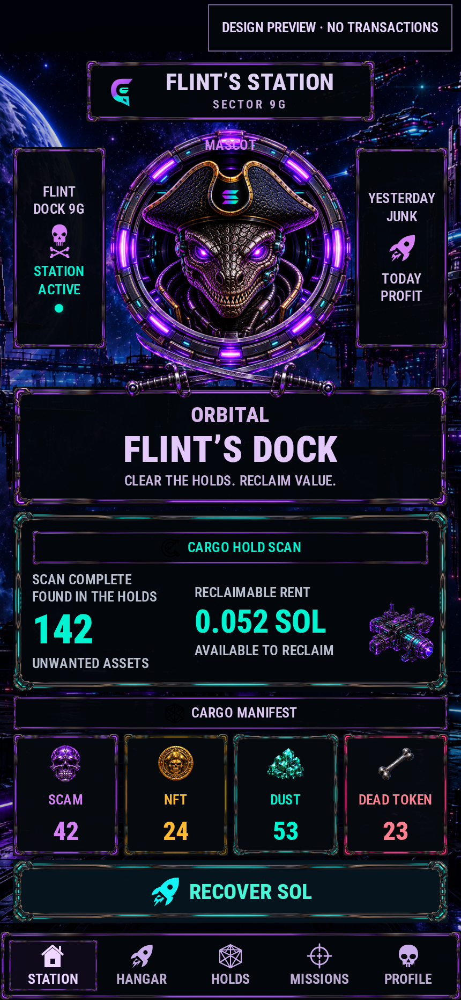

# Flint’s Dock

Flint’s Dock analyzes Solana wallets and prepares plans to recover SOL from token accounts. The React/Tauri 2 desktop application and Rust CLI share a core for discovery, classification, swap, burn, close and result verification.

Scanning and planning are read-only. Execution requires a local signer and explicit approval of the displayed actions. Native SOL remains available for fees; supported NFTs use separate Metaplex/Core/Bubblegum adapters.



_Design preview with sample values. The [gallery](docs/screenshots/README.md) distinguishes preview images from live read-only devnet captures._

## Quick start

Install Rust/Cargo and Node.js matching [package.json](apps/app/package.json): `^22.22.2 || ^24.15.0 || >=26.0.0`. Native desktop also requires Tauri system dependencies; see the [desktop README](apps/app/README.md).

From the repository root, launch desktop on devnet:

```bash
cd apps/app
npm ci
export DOCK_FLINTS_RPC_URL=https://api.devnet.solana.com
npm run desktop
```

In **DOCK A WALLET**, select **Public key (read only)** and enter:

```text
9FCR2PU1jZgCHyjWxzk2BNQHJxszAK24vBFiWmUyRNpv
```

This is the public address of the local `dev/demo-wallet.json`. The documentation workflow needs only the public key; signing material is not included in the documentation.

Read-only CLI scan from the repository root:

```bash
cargo run --locked -- scan \
  --pubkey 9FCR2PU1jZgCHyjWxzk2BNQHJxszAK24vBFiWmUyRNpv \
  --rpc-url https://api.devnet.solana.com \
  --all --all-tokens --no-prices --details --include-empty --format json
```

For browser design preview, run `npm run dev` in `apps/app` and open `http://127.0.0.1:1420/?preview=1`. Real wallet connection and analysis require Tauri IPC in the desktop window.

## Analysis results

- SOL, legacy SPL/Token-2022 accounts, fungible holdings, Unknown assets and verified classic/programmable/MPL Core NFTs.
- **SCAM**, **NFT**, **DUST** and **DEAD TOKEN** use one category result for both the counter and details. Counters contain only a number or `—`. Complete-empty results show `0`; partial results with known items show the number found; empty partial results show `—`. Reasons and coverage appear in details.
- Holdings aggregate by mint + token program and retain backing accounts. Repeated accounts/NFT IDs do not increase category counts. Categories can overlap.
- Unknown prices remain unknown. SCAM requires an explicit suspicious signal with a source; DUST requires reliable valuation of a nonzero holding; DEAD TOKEN requires a confirmed, scoped NoRoute. Category membership does not authorize a burn.
- Jupiter pricing/risk/routing are used only on verified mainnet. Devnet may show `—` with specific reasons. Provider failures preserve independently discovered on-chain assets.
- Desktop analysis and cleanup can use matching-network `DOCK_FLINTS_DAS_URL` for compressed NFTs. Without DAS, classic/Core NFTs remain visible, but total NFT coverage may be incomplete. Standalone CLI `scan --cnfts` does not yet enumerate compressed inventory.

Rust reads inherited environment variables; `.env` is not loaded automatically. CLI selects RPC with `--rpc-url`; desktop uses `DOCK_FLINTS_RPC_URL`. [Backend configuration](apps/app/backend.env.example) lists Jupiter, DAS, dust threshold and journal settings. Credentials stay in the backend, outside `VITE_*`.

## Documentation

| Guide                                                | Purpose                                                              |
| ---------------------------------------------------- | -------------------------------------------------------------------- |
| [Getting started](docs/getting-started.md)           | Launch desktop/browser/CLI, scan devnet and interpret results        |
| [CLI commands and examples](docs/cli-guide.md)       | Scan selection, JSON, read-only planning, quote and execution        |
| [Desktop usage](apps/app/README.md)                  | System dependencies, UI workflow, configuration and Tauri build      |
| [Screenshots](docs/screenshots/README.md)            | Screens, captions and capture provenance                             |
| [Current verification](docs/current-verification.md) | Actual checks, live devnet evidence and limitations                  |
| [Troubleshooting](docs/troubleshooting.md)           | Build, network, provider and coverage issues                         |
| [Documentation index](docs/README.md)                | Architecture, contracts, cleanup/NFT coverage and historical reports |

## Repository and checks

```text
crates/core/                Rust core, use cases, Solana/Jupiter adapters
apps/cli/                   CLI scan / quote / swap / cleanup
apps/app/src/               React UI
apps/app/src-tauri/         Tauri commands, sessions, plans, jobs, journal, DTOs
apps/app/frontend-contract/ typed TypeScript IPC boundary
docs/                      guides, reports, fixtures, screenshot materials
```

From the repository root:

```bash
cargo fmt --all --check
cargo check --workspace --locked
cargo test --workspace --locked
cargo clippy --workspace --all-targets --all-features --locked -- -D warnings
```

In `apps/app`:

```bash
npm run check
npm run test:e2e
npm run desktop:build
```

Browser fixtures, registered native IPC and live RPC are separate evidence sources. See the [current report](docs/current-verification.md) for completed checks and failures.

## Licensing

Project source code is licensed under [Apache License 2.0](LICENSE), allowing use, modification and redistribution, including commercial use, with the required notices. Attribution appears in [NOTICE](NOTICE).

The [listed branded graphical assets](ASSETS_LICENSE.md) have separate terms and are excluded from the code license. [BRANDING.md](BRANDING.md) explains using an independent name and branding for forks without implying official status or endorsement. Third-party resources retain their own licenses and notices. See the [licensing audit](docs/licensing-audit.md) for provenance that remains unverified.
