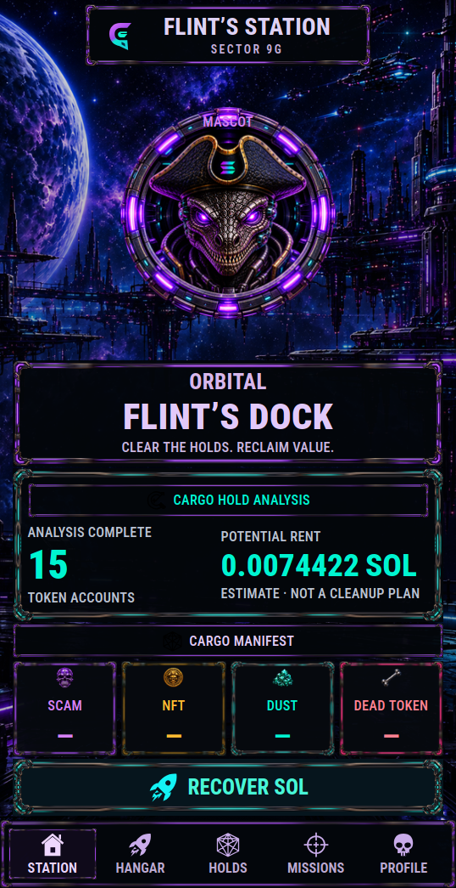

# Screenshot materials

The gallery contains **35 PNGs**: 12 browser design previews and 23 captures from the embedded-frontend Tauri application using a real read-only devnet scan. Sample screens and real wallet evidence are labelled separately.

## Live native devnet

Public address of the local documentation wallet `dev/demo-wallet.json`:
`9FCR2PU1jZgCHyjWxzk2BNQHJxszAK24vBFiWmUyRNpv`.

The capture script permits public-key `connect_wallet` and `analyze_wallet`, plus internal read-only Channel transport. It records authentic registered IPC responses and checks `canSign=false`. It does not prepare, sign or execute cleanup. The native application embeds the production React `dist` in a **debug-profile executable**; these are not browser mocks or installer/release-build claims.

| Screen                  | Native 430 CSS px                                                   | Native 360 CSS px                                                             |
| ----------------------- | ------------------------------------------------------------------- | ----------------------------------------------------------------------------- |
| Welcome                 | [welcome.png](devnet/welcome.png)                                   | Not recaptured                                                                |
| Public-key connection   | [connect-public-key.png](devnet/connect-public-key.png)             | Not recaptured                                                                |
| Actual scan in progress | [scanning.png](devnet/scanning.png)                                 | Not recaptured                                                                |
| Main menu               | [main.png](devnet/main.png)                                         | [main.png](devnet/phone-360/main.png)                                         |
| SCAM details            | [scam-details.png](devnet/scam-details.png)                         | [scam-details.png](devnet/phone-360/scam-details.png)                         |
| NFT coverage            | [nft-details.png](devnet/nft-details.png)                           | [nft-details.png](devnet/phone-360/nft-details.png)                           |
| DUST details            | [dust-details.png](devnet/dust-details.png)                         | [dust-details.png](devnet/phone-360/dust-details.png)                         |
| DEAD TOKEN details      | [dead_token-details.png](devnet/dead_token-details.png)             | [dead_token-details.png](devnet/phone-360/dead_token-details.png)             |
| Token inventory         | [inventory-tokens.png](devnet/inventory-tokens.png)                 | [inventory-tokens.png](devnet/phone-360/inventory-tokens.png)                 |
| All backing accounts    | [inventory-all-accounts.png](devnet/inventory-all-accounts.png)     | [inventory-all-accounts.png](devnet/phone-360/inventory-all-accounts.png)     |
| Classic/Core inventory  | [inventory-nft-core.png](devnet/inventory-nft-core.png)             | [inventory-nft-core.png](devnet/phone-360/inventory-nft-core.png)             |
| Compressed coverage     | [inventory-compressed-nft.png](devnet/inventory-compressed-nft.png) | [inventory-compressed-nft.png](devnet/phone-360/inventory-compressed-nft.png) |
| Read-only profile       | [profile.png](devnet/profile.png)                                   | [profile.png](devnet/phone-360/profile.png)                                   |

Actual native viewports: **430×836** and **360×779**, DPR **1.25**. [430 audit](devnet/audit.json) and [360 audit](devnet/phone-360/audit.json) record UTC timestamps, source revision, origin, real requests/DTO, counters/details and font/tile measurements. All numeric fields show `—` for this wallet’s coverage; no status words replace numbers. The 360 main geometry has a one-CSS-pixel scrollHeight/clientHeight rounding difference at fractional DPR; numeric fields have zero overflow. See [current verification](../current-verification.md).



_Real inventory, not sample category totals. Open the category dialogs for unavailable-provider reasons and incomplete NFT coverage._

### Reproduce native captures

Linux/WebKitGTK needs an available graphical session. Build with embedded frontend:

```sh
cd apps/app
npm ci
CARGO_BUILD_JOBS=2 CARGO_INCREMENTAL=0 npm run desktop:build -- --debug --no-backdrop --width=430
```

Launch the debug executable with the inspector bound to loopback. Replace the target path if `CARGO_TARGET_DIR` is customized:

```sh
env -u DOCK_FLINTS_DAS_URL -u JUPITER_API_KEY -u DOCK_FLINTS_DEVNET_TEST_MANIFEST \
GDK_BACKEND=x11 GDK_SCALE=1 GDK_DPI_SCALE=1 \
WEBKIT_INSPECTOR_SERVER=127.0.0.1:19222 \
WEBKIT_INSPECTOR_HTTP_SERVER=127.0.0.1:19223 \
DOCK_FLINTS_RPC_URL=https://api.devnet.solana.com \
DOCK_FLINTS_JOURNAL_PATH=/tmp/flints-docs-readonly/signatures.json \
../../target/debug/dock-flints-app
```

Desktop scaling determines actual CSS dimensions. In the captured session `devicePixelRatio` was 1.25, so physical **538×1045** produced approximately **430×836 CSS px**. Under X11 resize the application window before capture; use the same `DISPLAY` as the app. Adjust physical dimensions for your measured DPR:

```sh
# apps/app; these dimensions reproduce this session's DPR 1.25 composition
python3 tests/native/resize-x11-window.py 538 1045
export DOCK_NATIVE_OWNER="$(solana-keygen pubkey ../../dev/demo-wallet.json)"
DOCK_NATIVE_REPORT=../../docs/screenshots/devnet \
node tests/native/category-counters-readonly.mjs
```

Only a public base58 address reaches the app/harness. `solana-keygen` is optional: without an override, the harness uses the public demo address above. It never reads a keypair file. Native snapshot dimensions account for physical pixels so fractional desktop scaling does not crop the screenshots.

After capture, keep the completed scan open and all dialogs closed. Reuse the same authenticated snapshot at 360 CSS px:

```sh
# DPR 1.25: physical 450×974 → approximately 360×779 CSS px
python3 tests/native/resize-x11-window.py 450 974
DOCK_NATIVE_REUSE_SCAN=1 \
DOCK_NATIVE_REPORT=../../docs/screenshots/devnet/phone-360 \
node tests/native/category-counters-readonly.mjs
```

Use **Public key (read only)** throughout. Native processing/success are absent because this documentation session executes no cleanup. Omit inspector environment variables for normal launches.

## Browser design preview

These images display **DESIGN PREVIEW · NO TRANSACTIONS**. Category values, recovery estimates, progress and success are samples; they do not describe the devnet wallet or an executed transaction.

| Screen                  | 430 CSS px                               | 360 CSS px                                       |
| ----------------------- | ---------------------------------------- | ------------------------------------------------ |
| Welcome                 | [welcome.png](preview/welcome.png)       | [welcome-360.png](preview/welcome-360.png)       |
| Scan presentation       | [scanning.png](preview/scanning.png)     | [scanning-360.png](preview/scanning-360.png)     |
| Main menu               | [main.png](preview/main.png)             | [main-360.png](preview/main-360.png)             |
| Cleanup selection       | [cleanup.png](preview/cleanup.png)       | [cleanup-360.png](preview/cleanup-360.png)       |
| Processing presentation | [processing.png](preview/processing.png) | [processing-360.png](preview/processing-360.png) |
| Sample success          | [success.png](preview/success.png)       | [success-360.png](preview/success-360.png)       |

Preview viewports: 430×931 and 360×779, DPR 2. [Manifest](preview/manifest.json) records URLs, browser version, capture timestamp/revision and assertions: numeric fields contain only digits/`—`, horizontal overflow is zero.

```sh
# apps/app, first terminal
npx playwright install chromium
npm run dev -- --host 127.0.0.1

# apps/app, another terminal
node tests/native/documentation-preview-screenshots.mjs
```

`DOCK_PREVIEW_URL` overrides the local URL; `DOCK_PREVIEW_SCREENSHOTS` overrides the output directory. Default output is repository-root `docs/screenshots/preview/`.

## Licensing of materials

Capture scripts and documentation text use the project's [Apache-2.0 license](../../LICENSE). Screenshots contain artwork with [separate asset terms](../../ASSETS_LICENSE.md) and third-party resources; they do not grant rights to extract/reuse those images or imply official endorsement of another product. See [branding policy](../../BRANDING.md).
